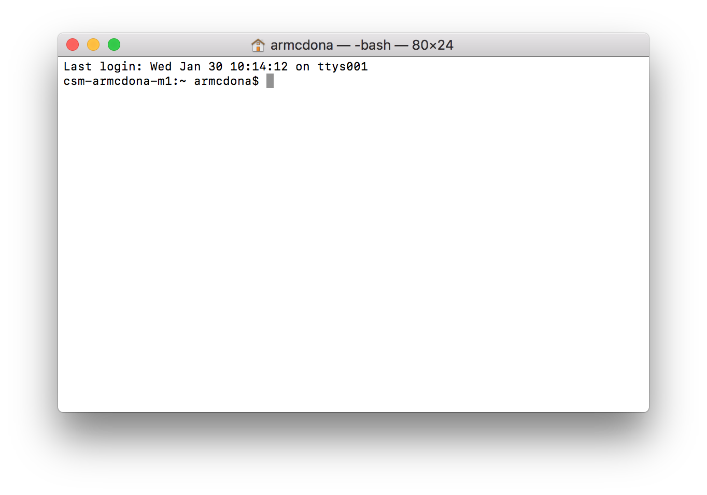

## Accessing the Terminal
The terminal is an interface in which you can type and execute text based commands. It is important to use the terminal to run many computational chemistry software packages.  There are several different types of terminal interfaces, called shells.  In this tutorial, we will focus on using one of the most common shells, the bash shell.  How you acquire a bash shell terminal depends on the type of computer you have.  

### Linux
If you are using a Linux computer, you probably already know how to open the terminal window.  If the Terminal is not shown in menu of programs, you can use the key combination CTRL + ATL + T to open the terminal window.

### Mac OS X
On Mac OS X, a Terimanl application is built into your system.  Open the Terminal from Applications -> Utilities -> Terminal.

### Windows
Windows has a built in command line interface.  To access it, click the Windows Key + R, type cmd, press Enter.  **However,**
this interface is not a bash application.  Therefore, the commands for navigating and creating files discussed below will not be the same.  To get a bash shell for Windows, install [Git for Windows](https://gitforwindows.org/).  Most of the default options are fine, but on the *Adjusting your PATH environment* screen you should select **Use Git and optional Unix tools from the Command Prompt** if you want to use bash commands within the terminal application.  Many computational chemistry software programs are run from the command prompt so this is recommended.  

Open Git Bash from the Start menu, Git -> Git Bash.

## Using the bash Terminal Window
The bash terminal window command prompt looks a little different in different operating systems, but usually the command prompt contains a `$` to let you know you are ready to start typing.

A Mac OS X terminal window.

## Resources
- [Using the command line](https://ryanstutorials.net/linuxtutorial/commandline.php
)
- [Navigation in bash](https://ryanstutorials.net/linuxtutorial/navigation.php)
- [Making and removing directories, copying and deleting files](https://ryanstutorials.net/linuxtutorial/filemanipulation.php)


